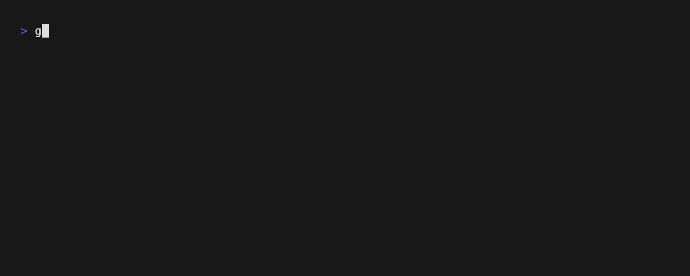

# mon(itor)

A progress monitor for Go applications.

This package aims to provide a simple and clean abstraction for reporting
progress to a user in a CLI.

    

## Features

- Built-in CLI animations and terminal UI.
- Runs asynchronously in the background using goroutines.
- Fluent builder API for adding tasks to the monitor.
- Supports determinate (fixed number of steps) and indeterminate tasks.
- Automatic estimated completion time calculations for determinate tasks.
- Extensible human-readable [formatting](https://pkg.go.dev/github.com/apollosoftwarexyz/mon/formatting) for values.
